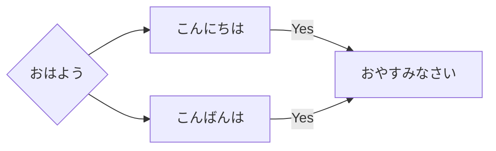
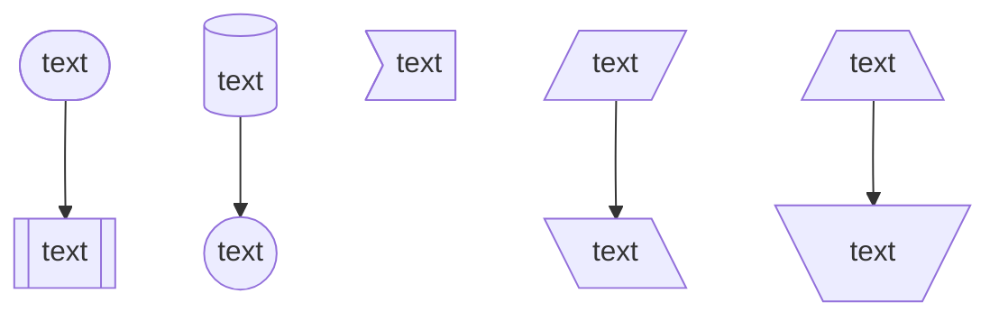
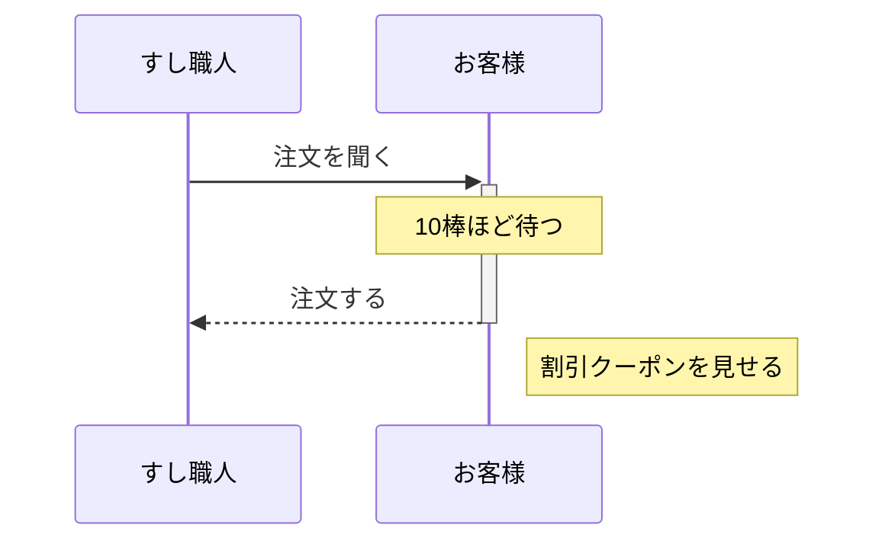
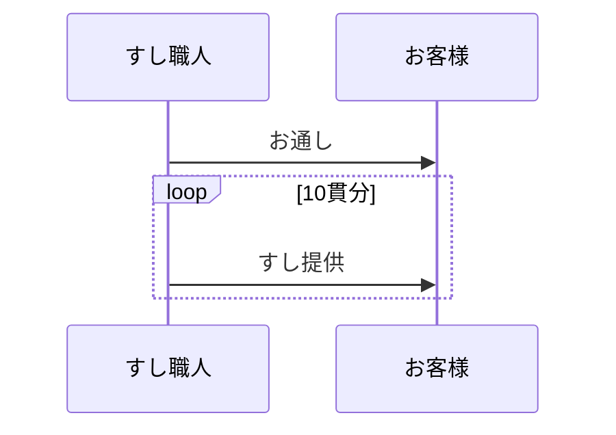
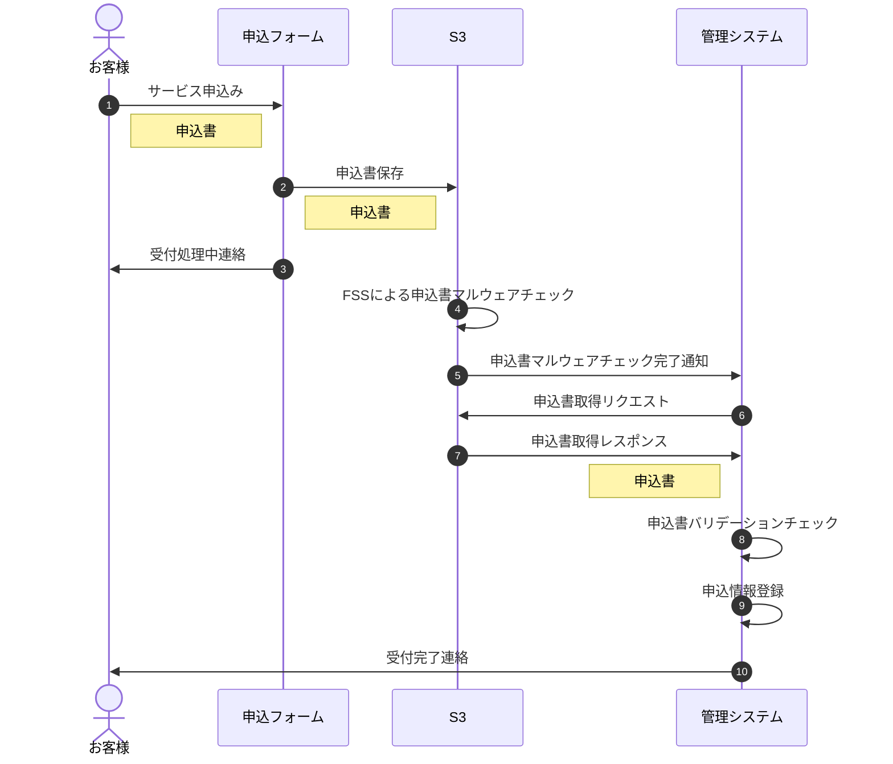
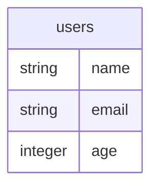
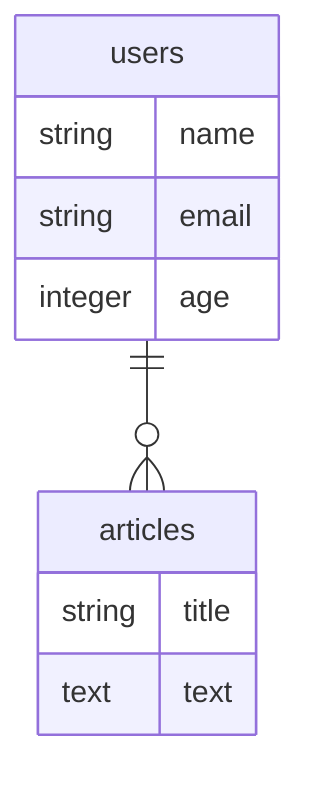

# mermaidExapmle
UMLが書けるMermaid記法の例です

# 上下サンプル


```
\```mermaid
graph TD;
    A-->B;
    A-->C;
    B-->D;
    C-->D;
\```
```

# 左右サンプル



```
\```mermaid
graph LR;
    A{"おはよう"}-->B;
    A-->C;
    B["こんにちは"]--Yes-->D;
    C["こんばんは"]--Yes-->D["おやすみなさい"];
\```
```

# nodeサンプル



```
\```mermaid
graph TD;
    A(["text"])-->B
    B[["text"]]
    C[("text")]-->D
    D(("text"))
    E>"text"]
    F[/"text"/]-->G
    G[\"text"\]
    H[/"text"\]-->I
    I[\"text"/]
\```
```

# シーケンスサンプル



```
\```mermaid
sequenceDiagram
    participant sushiCook as すし職人
    participant customer as お客様

    sushiCook ->>+ customer: 注文を聞く
    Note over customer: 10棒ほど待つ
    customer -->>- sushiCook: 注文する
    Note right of customer: 割引クーポンを見せる
\```
```

# シーケンスサンプル 繰り返し条件



```
\```mermaid
sequenceDiagram
    %% これはコメントなので表示されません
    participant sushiCook as すし職人
    participant customer as お客様

    sushiCook ->> customer: お通し
    loop 10貫分
        sushiCook ->> customer: すし提供
    end
\```
```

# シーケンスサンプル 諸々



```
\```mermaid
sequenceDiagram
    autonumber
    actor お客様
    participant form as 申込フォーム
    participant s3 as S3
    participant admin as 管理システム
    お客様->>form: サービス申込み
    Note left of form: 申込書
    form->>s3: 申込書保存
    Note left of s3: 申込書
    form->>お客様: 受付処理中連絡
    s3->>s3: FSSによる申込書マルウェアチェック
    s3->>admin: 申込書マルウェアチェック完了通知
    admin->>s3: 申込書取得リクエスト
    s3->>admin: 申込書取得レスポンス
    Note left of admin: 申込書
    admin->>admin: 申込書バリデーションチェック
    admin->>admin: 申込情報登録
    admin->>お客様: 受付完了連絡
\```
```

# ER図サンプル



```
\```mermaid
erDiagram

users {
  string name
  string email
  integer age
}
\```
```



```
\```mermaid
erDiagram
users ||--o{ articles: ""

users {
  string name
  string email
  integer age
}

articles {
  string title
  text text
}
\```
```
